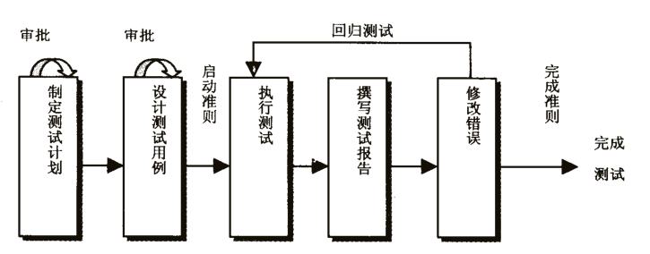
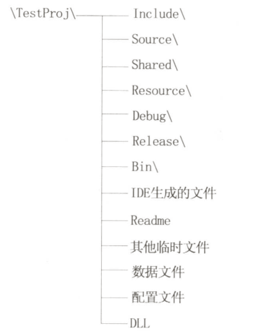
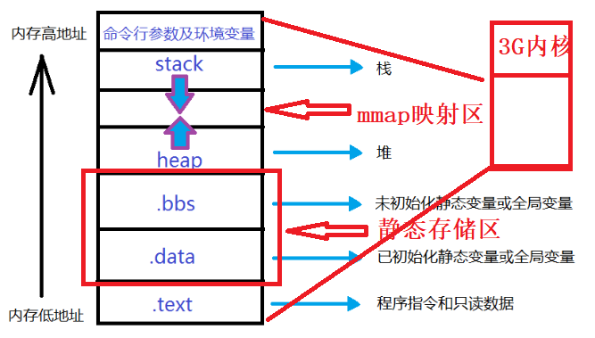

# 工程开发基础---编码规范
## 声明：
---
> 本课程仅仅对程序员在开发过程中基础编程行为的进行规范，一是用来提高项目开发的可交流性，二是用来提高程序程序设计的质量。对于算法上并不做规范要求。仅作内部交流使用。

## 目录
---
+ 第01章 课程目标
+ 第02章 课程内容
    - 2.1 内容简介
    - 2.2 高质量软件编程之道
        - 2.2.1 软件质量的定义
        - 2.3.2 高质量软件的属性
        - 2.4.3 为什么要讲高质量软件编程？
        - 2.5.4 软件的调试与测试
    - 2.3 开始高质量软件编程之路
        - 2.3.1 排版
        - 2.3.2 常量及表达式
        - 2.3.3 函数设计
    - 2.4 高质量软件编程进阶之路
        - 2.4.1 内存管理
        - 2.4.2 程序效率
        - 2.4.3 代码的测试与维护
+ 第03章 课程总结
+ 第04章 课程评价
---
 
## 正文
---

# 第01章 课程目标

软件质量一直都是被程序员挂在嘴边而没有实际行动的一件重要的事情，不论是刚迈入程序员道路的新手，还是正在程序员的道路上行走的老手。

本课程从高质量软件的基础出发，对高质量软件编程进行了介绍。之后对高质量软件编程设计进行了编码规范。

通过编程规范进行程序的设计，一方面可以提高编程的效率和高质量的设计，另一方面可以形成良好的编码风格。不仅方便别人阅读自己的代码，还便于交流，提高编程水平。最后对高质量编程的进阶之路进行了简单的介绍。

>> 什么是好的设计？        
>> 1. 好的设计应当恰如其分地反映、解决一个具体的问题，没有不必要的特性；
>> 2. 好的设计应该尽量降低对象之间、模块之间的耦合性。

要想提高编程质量，仅仅通过看书是有限的，要将书上的知识与实际的编码风格结合，逐渐过渡到成熟的编码风格。

# 第02章 课程内容

## 2.1 内容简介
---
本课程第一章对高质量软件编程进行了介绍，解答了为什么要进行高质量编程。第二三章对高质量软件编程之路进行了详细的介绍。通过不断的练习，形成自己的高质量编码风格。最后对课程进行了总结。接下来进入高质量软件编程之路的学习吧！！！

## 2.2 高质量软件编程之道

### 2.2.1 软件质量的定义
> 软件质量：
> 1. 一个系统、组件或过程符合特定需求的程度；
> 2. 一个系统、组件或过程符合客户或用户的要求或期望的程度。
~~~
如何理解软件质量的定义？

通俗的讲，就是软件能够按照既定的规则运行，并且不会出现错误。
~~~
当然，什么东西都有评价方法，我们可以通过考察软件的质量属性来评价软件的质量。软件开发人员可以对正确性、健壮性、可靠性、效率、易用性、可读性（可理解性）、可扩展性、可复用性、兼容性、可移植性等质量属性应进行详细的了解和认识，并给出提高软件质量的方法。

### 2.2.2 高质量软件的属性
软件的质量属性有很多，我们从实用性出发，在这里主要介绍10种重要的软件质量属性。

从功能的角度出发，将10种软件质量属性划分为：
> * 功能性质量属性：正确性、健壮性、可靠性。
> * 非功能性质量属性：性能、易用性、清晰性、安全性、可扩展性、兼容性、可移植性。

* ### 功能性

    正确性：软件质量属性中最重要的部分，指软件按照需求正确执行任务的能力。从软件的“需求开发”到“系统设计”到“实现”，都对软件的正确性有很高的要求。

    健壮性：在软件出现异常的情况下，软件依然正常的运行的能力。健壮性是软件在需求范围之外的行为。
    > 健壮性的两层含义：1、容错能力。2、恢复能力。
    > * 容错：指发生异常情况时系统不出错误的能力。(针对不同的软件项目需求，容错性有很大的差别。)
    > * 恢复：指软件发生错误后能够重新运行，并且恢复到没有发生错误前的状态。(例如：使用电脑时，有时会出现死机，但重启后，系统依然能够恢复到之前的状态)

    可靠性：是一个与时序相关的属性，指在一定环境，在一定时间段内，程序不出现故障的概率。用“平均无故障时间”来衡量。
    >故障和错误的区别：
    > * 故障：在测试时的环境和条件不足以使代码或硬件中的错误暴露。不可预料，后果严重。
    > * 错误：例如语法、语义等可预见的错误，在调试的时候就可以改正。

* ### 非功能性

    性能：指软件的“时间-空间”效率，可以通过优化数据结构、算法复杂度进行提前的预估。
    > 目标：“既要马儿跑的快，又要马儿吃得少”。

    易用性：指用户使用软件的容易程度。(最好是使用按键对应的功能)，测试最好是从用户角度出发，进行用户测评。

    清晰性：指软件成果易读、易理解，让用户在使用时明白用的是什么东西。和易用性相照应。只有研发人员思路清晰，才能写出易读，可理解的程序，简洁。

    安全性：指信息安全。
    > 不存在绝对安全的软件或系统，但如果盗用软件或系统的代价大于开发软件的成本，就认为软件或系统是安全的。

    可扩展性：指软件适应“变化”的能力。   (软件或系统设计阶段重点考虑的质量属性)

    兼容性：指两个或两个以上的软件相互交换信息的能力。
    > 兼容性规则：弱者设法与强者兼容，强者应避免被兼容。

    可移植性：指软件不经修改或稍加修改就可以运行于不同软硬件环境的能力。

### 2.2.3 为什么要讲高质量软件编程
程序员最大的对手是自己，随意的按照自己的规则去写程序。当自己写的东西里有缺陷，而自己花了很长时间还没有找到缺陷，这时就懊恼自己的编程的坏习惯。只有在编程初期逐渐养成好的习惯，才能在出现错误时，很快的定位错误的位置。

我们学习高质量软件编程的目的是：
~~~
    在写程序的时候一次性的写出高质量程序，而不是在程序出错的时候花费大量的时间去找错误。
~~~

提高软件的质量最本质上是消除缺陷，消除缺陷有以下三种方式：
> 1. 将高质量编程内建于开发过程中，而不是在出错后花费大量的时间找错误，**最佳方式**。
> 2. 在开发完成后立马**进行软件测试**，从而尽快的消除软件开发过程中的一些缺陷。
> 3. 软件交付后，出现问题，及时补救。

### 2.2.4 软件的调试与测试

* ### 软件的调试
    > 软件调试：寻找错误的根源的过程。

    调试的基本方法是“粗分细找”。有些隐藏很深的Bug，应该运用归纳、推理等方法，确认Bug的范围，最后再用调试工具仔细地跟踪此范围的源代码。

    调试时注意事项：
	1. 寻找到错误不要急于修改，应先思考修改该错误会不会引发其他的错误。
	2. 思考是不是还存在类似的错误，一并解决。
	3. 修改完错误后要马上回归测试，避免其他错误产生。

* ### 软件的测试
    > 软件测试是通过测试用例来找出软件的缺陷。
    
    在软件开发过程中，编程与测试是紧密相关的，但是现在软件的测试一直是被程序员或企业所忽略的，一是软件的测试会增加软件的开发成本，二是没有系统的软件测试人员和相关知识。
    
    由于本文档只是对C/C++进行编码规范，就不花费大量的篇幅去介绍软件测试的方法和流程，仅仅给出简单的方法和流程。但并不代表软件的测试不重要，相反软件的测试是软件投产最重要的步骤，希望读过此文档之后能够重视起来，并且深入学习相关的测试方法。

    ~~~
    软件测试的常规分类：
    测试阶段：单元测试、集成测试、系统测试、验收测试。
    测试方式：白盒测试、黑盒测试。
    测试内容：功能测试、健壮性测试、性能测试、用户界面测试、安全性测试、压力测试、可靠性测试......
    ~~~

    **测试流程**：

    

## 2.3 开始高质量软件编程之路

### 2.3.1 排版

* #### 1. 文件结构

    每个C/C++程序通常分为两类文件，一类文件用于保存程序的声明，称为头文件；另一类文件用于保存程序的实现，称为源文件。

    C/C++程序的头文件以`.h`为后缀，C程序的源文件以`.c` 为后缀，C++程序的源文件以`.cpp`为后缀。

    C/C++编译器在读取到一条函数调用语句时首先应当知道该函数的原型和定义，函数原型一般都放在头文件中，函数定义放在源文件中，当编译器在源文件中读取到`#include`指令包含另一个头文件的时候，编译预处理器用头文件的内容取代`#include`指令，最后头文件的所有内容会被合并到某一个或几个源文件中。

    * #### 版权声明
        ~~~
        为什么要在头文件和源文件前加入版权和版本信息？
        如果你在企业工作，请记住：你已经不是学生了，你工作期间编写的一切代码都是属于企业的，所以要给每个程序打上企业的“名号”，即版权和版本声明。
        ~~~

        版权、版本信息的主要内容有：
        
        1. 版权信息；
        2. 文件名称，标识符，摘要；
        3. 当前版本号，作者/修改者，完成日期；
        4. 版本历史信息。

        格式参考入下：
        ```
        /**************************************************
        * Copyright (c) 2017,北京中科浩电科技有限公司研发部
        * All rights reserved.
        *
        *
        * 文件名称： filename.h
        * 文件标识： 见配置管理计划书
        * 摘    要： 简要描述本文件的内容、功能
        *
        * 
        * 当前版本： 1.1
        * 作    者： 输入作者（或修改者）名字
        * 完成日期： ***年**月**日
        * 修改说明：
        *
        * 取代版本：1.0
        *  原作者 ： 输入原作者（或修改者）名字
        * 完成日期： ***年**月**日
        * 原版本说明：
        *
        **************************************************/
        ```

    * #### 头文件的结构与作用

        * #### 头文件的作用：
        
        1. 通过头文件来调用库函数。用户只要按照头文件中的接口声明来调用库函数，不必关心接口的实现；
        2. 头文件能加强类型安全检查，如果出现函数实现或使用时的方式与头文件中的声明不一致，编译器会指出错误；
        3. 提高程序的可读性。

        * #### 头文件的结构：
        
        **[规则2-3-1-1]** 为了防止头文件被重复引用，应当用 `ifndef/define/endif` 结构产生预处理块。
        
        **[规则2-3-1-2]** 用 `#include <filename.h>` 格式来引用标准库的头文件（编译器将从标准库目录开始搜索）。
        
        **[规则2-3-1-3]** 用 `#include “filename.h” `格式来引用非标准库的头文件（编译器将从用户的工作目录开始搜索）。

        结构如下：
         
        > 1. 头文件的注释(包括文件说明、功能描述、版权声明等)。
        > 2. 内部包含“卫哨开始”(`#ifdef 头文件名大写`、`#define 头文件名大写`)
        > 3. `#include`其他头文件 (如果需要)
        > 4. 外部变量、全局函数声明 (如果需要)
        > 5. 常量、宏定义 (如果需要)
        > 6. 类型前置声明、定义 (如果需要)
        > 7. 全局函数原型和内联函数的定义 (如果需要)
        > 8. 内部包含“卫哨结束” `#endif`
        > 9. 文件版本及修订说明  

        格式参考如下：
        ```
        #ifndef GRAPHICS_H // 防止 graphics.h 被重复引用
        #define GRAPHICS_H
        #include <math.h>  // 引用标准库的头文件
        …
        #include “myheader.h” // 引用非标准库的头文件
        …
        void Function1(…); // 全局函数声明
        …
        class Box // 类结构声明
        {
            …
        };
        #endif
        ```
    * #### 源文件的结构

        C/C++源文件用来保存函数的实现和类的实现，其结构如下：
        > 1. 源文件注释(包括文件说明、功能描述、版权声明等等)
        > 2. 预处理指令
        > 3. 常量 、宏定义
        > 4. 外部变量声明、全局变量定义及初始化
        > 5. 成员函数和全局函数的定义
        > 6. 文件修改记录

    上述头文件、源文件的结构可根据实际情况灵活安排。 

* #### 2. 程序文件目录结构
    一个正在开发的程序工程不仅包含源代码文件，还包含许多资源文件、数据文件、库文件及配置文件等等，为了方便于开发与维护，我们需要有个一目了然的目录结构。例如，我们创建一个C/C++程序工程TestProj，其程序目录结构可以参照图2-1上所示。

    **图2-1 程序目录结构参照图**：

    

    图2-1说明：
    > 1. **Include**存放程序的头文件(`.h`),还可以添加子文件。
    > 2. **Source**存放程序的源文件(`.c .cpp`)，还可以添加子文件。。
    > 3. **Shared**存放一些共享的文件。
    > 4. **Resource**存放程序所用的各种资源文件，还可以添加子文件。
    > 5. **Debug**存放程序发行版本生成的中间文件。
    > 6. **Bin**存放程序员自己创建的lib文件或dll文件。

* #### 3. 程序版式

    版式虽然不会影响程序的功能，但是会影响程序的可读性和清晰性。可以使维护人员明了程序的内容。

    * #### 空行
    >> 空行起着分隔程序段落的作用。使用得当使得程序的布局更加清晰。
    
    **[规则2-3-1-4]** 在每个类声明之后、每个函数定义结束之后都要加空行。
    
    **[规则2-3-1-5]** 在一个函数体内，逻揖上密切相关的语句之间不加空行，其它地方应加空行分隔。

    实例：
    ~~~
    // 空行
    void Function1(…)
    {
        …
    }
    // 空行
    void Function2(…)
    {
        …
    }

    // 空行
    while (condition)
    {
        statement1;
        // 空行
        if (condition)
        {
            statement2;
        }
        // 空行
        statement4;
    }
    ~~~
    
    * #### 代码行
    
    **[规则2-3-1-6]** 一行代码只做一件事情，如只定义一个变量，或只写一条语句。这样的代码容易阅读，并且方便于写注释。

    **规则[2-3-1-7]** `if、for、while、do` 等语句自占一行，执行语句不得紧跟其后。不论执行语句有多少都要加{}。这样可以防止书写失误。

    **[规则2-3-1-8]**尽可能在定义变量的同时对变量进行初始化。(就近原则)

    实例：
    ~~~
    int width = 10;  // 宽度
    int height = 10; // 高度
    int depth = 10;  // 深度
    //空行
    x = a + b;
    y = c + d;
    z = e + f;
    //空行
    if (width < height)
    {
        dosomething();
    }
    //空行
    for (initialization; condition; update)
    {
        dosomething();
    }
    // 空行
    other();
    ~~~

    * #### 代码行内空格
    >> 说明：采用这种松散方式编写代码的目的是使代码更加清晰

    **[规则2-3-1-9]** 关键字之后要留空格。比如 `const、virtual、inline、case` 等关键字之后至少要留一个空格，否则无法辨析关键字;`if、for、while` 等关键字之后应留一个空格再跟左括号‘（’，以突出关键字。

    **[规则2-3-1-10]** 函数名之后不要留空格，紧跟左括号‘（’，与关键字区别。

    **[规则2-3-1-11]**  左括号‘（’向后紧跟，右括号‘）’、逗号‘，’、分号‘;’向前紧跟，紧跟处不留空格。

    **[规则2-3-1-12]** 逗号‘，’之后要留空格，比如 `Function(x, y, z)`。如果分号‘;’不是一行的结束符号，其后要留空格，比如 `for 空格(initialization; condition; update)`。

    **[规则2-3-1-13]** 赋值操作符、比较操作符、算术操作符、逻辑操作符、位域操作符，比如“=”、“+=”、“>=”、“<=”、“+”、“-”、“*”、\*/\*、“%”、“&&”、“||”、“<<”,“^”等二元操作符的前后应当加空格。

    **[规则2-3-1-14]** 单目操作符如“!”、“~”、“++”、“--”、“&”（地址运算符）等前后不加空格。

    **[规则2-3-1-15]** 比如 中括号“［］”、小数点“.”、立即操作符“->”这类操作符前后不加空格。

    **[规则2-3-1-16]** 修饰符 * 和 & 应当紧靠进变量名。
    >>说明：若将修饰符 * 靠近数据类型,从语法上来讲比较符合，但容易引起误解。比如：`int* x, y;` 此处 `y` 容易被误解为指针变量。

    **建议：** 对于表达式比较长的 `for` 语句和 `if `语句，为了紧凑起见可以适当地去掉一些空格，如 `for (i=0; i<10; i++)和 if ((a<=b) && (c<=d))`

    示例：
    ~~~
    void Func(int a, int b, int c);
    
    if (min > 1000)
    if ((a >= b) && (b < c>))

    for (i = 0; i < 100; i++)

    x = (a < b) ? a : b;

    int *p = &x;
    array[6] = {0}; 
    a.Func();
    b->Func();

    int *x, y;                   //变量y不会被误解为指针变量
    ~~~

    * #### 对齐

    **[规则2-3-1-17]** 程序的分界符 ‘{’ 和 ‘}’ 应**独占一行并且位于同一列**，同时与引用它们的语句左对齐。

    **[规则2-3-1-18]** { }之内的代码块在 ‘{’ 右边数格处**左对齐**。

    示例：
    ~~~
    void Function(int x)
    {
        …     // program code
    }
    //空行
    if (condition)
    {
        …    // program code

    }else
    {
        …   // program code
    }
    //空行
    如果出现嵌套的｛｝，则使用缩进对齐，如：
    {
        …
        
        {
            …
        }
        
        …
    }
    ~~~
    
    * #### 长行拆分

    **[规则2-3-1-19]** 代码行最大长度宜控制在 70 至 80 个字符以内。

    **[规则2-3-1-20]** 较长的语句（ >80 字符）要分成多行书写，长表达式要**在低优先级操作符处划分新行，操作符放在新行之首**，划分出的新行要进行适当的缩进，使排版整齐。

    **[规则2-3-1-21]** 循环、判断等语句中若有较长的表达式或语句，则要进行适应的划分，**长表达式要在低优先级操作符处划分新行，操作符放在新行之首**。

    示例：
    ~~~
    perm_count_msg.head.len = NO7_TO_STAT_PERM_COUNT_LEN 
                            + STAT_SIZE_PER_FRAM * sizeof( _UL );

    act_task_table[frame_id * STAT_TASK_CHECK_NUMBER + index].occupied 
                    = stat_poi[index].occupied;

    if ((very_longer_variable1 >= very_longer_variable12)
        && (very_longer_variable3 <= very_longer_variable14)
        && (very_longer_variable5 <= very_longer_variable16))
    {
        dosomething();
    }

    for (very_longer_initialization;
        very_longer_condition;
        very_longer_update)
    {
        dosomething();
    }
    ~~~

    * #### 类的版式

    >> 类可以将数据成员和成员函数封装在一起，其中成员函数表示了类的行为（或称服务）。类提供关键字 `public、protected` 和 `private`，分别用于声明哪些数据成员和成员函数是公有的、受保护的或者是私有的。这样可以达到信息隐藏的目的。

    类的版式有两种：

    1.  将` private` 类型的数据写在前面，而将 `public` 类型的函数写在后面，采用这种版式的程序员主张类的设计“以数据为中心”，重点**关注类的内部结构**。
    2. 将 `public` 类型的函数写在前面，而将 `private` 类型的数据写在后面，采用这种版式的程序员主张类的设计“以行为为中心”，重点**关注的是类应该提供什么样的接口**（或服务）。

    **建议:** 采用“以行为为中心”的书写方式，即首先考虑类应该提供什么样的函数。——“这样做不仅让自己在设计类时思路清晰，而且方便别人阅读。

* #### 4. 注释
    C 语言的注释符为“/*…*/”。C++语言中，程序块的注释常采用“/*…*/”，行注释
    一般采用“//…”。注释通常用于：
    + 版本、版权声明；
    + 函数接口说明；
    + 重要的代码行或段落提示。
    
    一般情况下，源程序有效注释量必须在 0~20%以上。并且统一注释格式。
    >> 说明：注释的原则是有助于对程序的阅读理解，在该加的地方都加了，注释不宜太多也不能太少，注释语言必须准确、易懂、简洁。

    **[规则2-3-1-22]** **边写代码边注释，修改代码同时修改相应的注释**，以保证注释与代码的一致性。不再有用的注释要删除。
    
    **[规则2-3-1-23]** (针对企业) **说明性文件头部应进行注释**，注释必须列出：版权说明、版本号、生成日期、作者、内容、功能、与其它文件的关系、修改日志等，头文件的注释中还应有函数功能简要说明。

    示例：
    ~~~
    /********************************************************
    版权说明     
    File Name：               //文件名
    Author：         Version：          Date：        //作者、版本号、日期
    Description：     //描述此程序文件完成的主要功能，
                     //与其他模块或函数的接口，输出值、取值范围、含义
                     //及参数间的控制、顺序、独立或依赖关系
    Others:          //其他内容的说明  
    Function List：  //主要函数列表，每条记录包含函数名及其功能简要说明。
    1....
    History：       //修改历史记录，包括修改时间、修改人及修改内容简述。
    1. date：
        Author：
        Modification：
    2. .....

    *******************************************************/
    ~~~

    **[规则2-3-1-24]**(针对企业) 源文件头部进行注释，列出：版权说明、版本号、生成日期、作者、模块功能、主要函数其功能、修改日志等。

    示例：
    ~~~
    /******************************************************
    版权说明
    FileName：test.c
    Author：      Version：     Date： 
    Description：    //模块描述
    Version：        //版本信息
    Function List：  //主要函数及其功能
        1. .....
    History：        //历史修改记录
        作者       时间      版本     修改描述
    
    *****************************************************/
    ~~~

    **[规则2-3-1-25]** 函数头部进行注释，列出：函数的功能、输入参数、输出参数、返回值、调用关系(函数、表)等。

    示例：
    ~~~
    /*******************************************************
    Function：      //函数名称
    Description：   //函数功能、性能的描述
    Calls：         //被本函数调用的函数清单
    Called By：     //调用本函数的函数清单
    Table Accessed：//被访问的表(数据库)
    Table Updated： //被修改的表(数据库)
    Input：         //输入参数说明，每个参数的作用、取值范围及参数间的关系
    Output：        //输出参数说明
    Return：        //返回值说明
    Others：        //其他附加说明

    *******************************************************/
    ~~~

    **[规则2-3-1-26]** 注释应与其描述的代码相近，**对代码的注释应放在其上方或右方（对单条语句的注释）相邻位置**，不可放在下面，如放于上方则需与其上面的代码用空行隔开。

    示例：
    ~~~
    /* get replicate sub system index and net indicator */
    repssn_ind = ssn_data[index].repssn_index;
    repssn_ni = ssn_data[index].ni;
    ~~~

    **[规则2-3-1-27]** 对于所有有物理含义的变量、常量，如果其命名不是充分自注释的，在声明时都必须加以注释，说明其物理含义。**变量、常量、宏的注释应放在其上方相邻位置或右方**。

    示例：
    ~~~
    /* active statistic task number */
    #define MAX_ACT_TASK_NUMBER 1000
    #define MAX_ACT_TASK_NUMBER 1000    /* active statistic task number */
    ~~~

    **[规则2-3-1-28]** 全局变量要有较详细的注释，包括对其功能、取值范围、哪些函数或过程存取及存取说明。

    示例：
    ~~~
    /* The ErrorCode when SCCP translate */
    /* Global Title failure, as follows */ // 变量作用、含义
    /* 0 － SUCCESS 1 － GT Table error */
    /* 2 － GT error Others － no use */ // 变量取值范围
    /* only function SCCPTranslate() in */
    /* this modual can modify it, and other */
    /* module can visit it through call */
    /* the function GetGTTransErrorCode() */ // 使用方法
    BYTE g_GTTranErrorCode;
    ~~~

    **[规则2-3-1-29]** 数据结构声明(素组、结构体、类、枚举等)必须加以注释。对数据结构的注释应放在其上方；对结构中的变量注释应放在其右方。

    示例：
    ~~~
    /*数据结构的名称及其主要信息*/
    enum  WEEKDAY            /*类型标识符(大写) */
    {
        SUNDAY,
        MONDAY,
        FRIDAY,
        TUSDAY                    /*枚举值表*/
    };
    ~~~

    **[规则2-3-1-30]** 注释与解释内容同样进行缩进；并且将注释与其上方的代码使用空行隔开。

    示例：
    ~~~
    void code_Func(void)
    {
        /*code one*/
        Code one
        //空行
        /*code two*/
        Code two
    }
    ~~~

    **[规则2-3-1-31]** 在程序块结束行的右方加注释标记，表明该程序块结束。

    示例：
    ~~~
    if (index > 0)
    {
        //program code
        while(index < MAX_INDEX)
        {
            //program code
        
        }/*end of while(index < MAX_INDEX)*/
    
    }/*end of if(index > 0)
    ~~~

* #### 5. 命名规则
    命名规则其实是容易对程序员形成一种约束，不能让程序员自由的进行命名。但从程序理解程度上来说，一些共性的命名规则能够更加使别人阅读程序。以下命名规则是被大多数程序员所采纳的。

    * #### 标识符的命名
    
    **[规则2-3-1-32]** 标识符的命名要清晰，有明确的含义，同时缩写使用大家都基本可以理解的缩写。

    示例：(一些公认的缩写)
    ~~~
    temp 缩写为 tmp ;
    flag 缩写为 flg ;
    statistic 缩写为 stat ；
    increment 缩写为 inc ；
    message 缩写为 msg ；
    ~~~

    * #### 常量、变量的命名
    
    **[规则2-3-1-33]** 对于变量命名，禁止取单个字符(i,j,k...)，建议使用小写字母开头的单词组合。在局部循环变量中i，j，k...是允许的。

    示例：
    ~~~
    BOOL flag；
    int drawMode；
    ~~~

    **[规则2-3-1-34]** 常量全用大写的字母，用下划线分隔单词。
    示例：
    ~~~
    const int MAX = 100;
    const int MAX_LENGTH = 100;
    ~~~

    **[规则2-3-1-35]** 静态变量加前缀s_(static)，全局变量使用前缀g_（global）
    示例：
    ~~~
    static int s_initValue;
    int g_howManyPeople;   //全局变量
    ~~~

    * #### 接口的命名

    **[规则2-3-1-36]**  ： 在同一软件产品内，应规划好接口部分标识符（变量、结构、函数及常量）的命名，防止编译、链接时产生冲突。
    >说明：对接口部分的标识符应该有更严格限制，防止冲突。如可规定接口部分的变量与常量之前加上“模块”标识等。为了团队间更好的进行接口控制。

    * #### 宏定义的命名
    **[规则2-3-1-37]** 使用宏定义表达式时，使用括号的进行隔离。

    示例：
    ~~~
    #define RECTANGLE_AREA(a, b)  (a) * (b)    //长方形的面积
    ~~~

    **[规则2-3-1-38]** 将宏定义的多条表达式放在{}中。

    示例：
    ~~~
    #define INIT_RECT_VALUE(a, b)\
    {\
        a = 0;\
        b = 0;\
    }

    for (index  = 0; index < RECT_TOTAL_NUM; index++)
    {
        INIT_RECT_VALUE(rect[index].a, rect[index].b);
    }
    ~~~

    **特别注意：使用宏定义时，不允许改变参数的值**。
    
    > **建议**：对于命名规则，可以参考[驼峰命名法][1]。写代码过程中在遵寻上述规则的同时，逐渐形成自己的命名规则。

### 2.3.2 常量及表达式

* ### 常量
    ~~~
    为什么要使用常量？
    1. 程序的可读性（可理解性）变差。程序员自己会忘记那些数字或字符串是什么意思，用户则更加不知它们从何处来、表示什么。
    2. 在程序的很多地方输入同样的数字或字符串，难保不发生书写错误。
    3. 如果要修改数字或字符串，则会在很多地方改动，既麻烦又容易出错。
    ~~~

    常量的分类：
    
    * 字面常量：直接出现的各种进制数，字符或字符串等。
    示例：
    ~~~
    x = -100.9f;
    #define OPEN_SUCCESS 0x00000001
    char c = 'a';
    char *pChar = "adfkfas";
    int *pInt = NULL; 
    ~~~
    * 符号常量：存在两种，用`#define`定义的宏常量、用const定义的常量。尽量使用含义直观的符号常量来表示程序中多次出现的数字或字符串。

    示例：
    ~~~
    #define MAX 100        //宏常量
    const int MAX = 100；  //const常量
    const float PI = 3.14；//const常量
    ~~~

    * 契约性常量：契约性const常量的定义并未使用关键字const，但被看做是一个const常量。
    
    示例：
    ~~~
    void ReadValue(const int &num)
    {
        printf("%d\n",num);
    }

    int main()
    {
        int n = 0;

        ReadValue(n); //n被看做是const常量。

        return 0;
    }
    ~~~
    * 枚举常量：使用关键字enum来定义一些常量集合。

    示例：
    ~~~
    enum Gigantic
    {
        SMALL = 10；
        GIGANTIC = 800000
    }；
    ~~~

* 在C++中const和define比较

    C++ 语言可以用 const 来定义常量，也可以用 #define 来定义常量。但是前者比后
者有更多的优点：
    * const 常量有数据类型，而宏常量没有数据类型。编译器可以对前者进行类型安全检查。而对后者只进行字符替换，没有类型安全检查，并且在字符替换可能会产生意料不到错误（边际效应）。
    * 有些集成化的调试工具可以对 const常量进行调试，但是不能对宏常量进行调试。

* 常量使用规则

    **[规则2-3-2-1]** 需要对外公开的常量放在头文件中，不需要对外公开的常量放在定义文件的头部。为便于管理，可以把不同模块的常量集中存放在一个公共的头文件中。

    **[规则2-3-2-2]** 如果某一常量与其它常量密切相关，应在定义中包含这种关系，而不应给出一些孤立的值。

    示例：
    ~~~
    const float RADIUS = 100;
    const float DIAMETER = RADIUS * 2;
    ~~~

* ### 表达式
    表达式属于C/C++的短语结构语法，看似简单，使用时隐患还是比较多的。
    
    * 表达式使用规则
    
    **[规则2-3-2-3]** 如果代码中的运算符比较多，使用括号确定表达式的操作顺序，避免使用默认的优先级。

    示例：
    ~~~
    word = (high << 8) | low

    if ((a | b) && (a & c))
    ~~~ 

    **[规则2-3-2-4]** 不要编写太复杂的复合表达式。

    **[规则2-3-2-5]** 不要有多用途的表达式。

    **[规则2-3-2-6]** 不要和数学表达式混淆。

    示例：
    ~~~
    i = a < b && c < d && e >= f; //复合表达式过于复杂。
    d = (a = b + c) + r; //过多表达式
    if (a < b < c)   //数学表达式
    ~~~

### 2.3.3 函数设计
   
函数是C/C++程序的基本功能单元，在这里重要介绍函数设计的基础规则。

* #### 参数的规则
    **[规则2-3-3-1]** 参数的书写要完整，如果函数没有参数，用void填充。
    
    示例：
    ~~~
    void SetValue(int width,int height);  //参数命名规范
    float GetValue(void);
    ~~~
    **[规则2-3-3-2]** 参数的命名要有意义。顺序要合理。

    示例：
    ~~~
    void StringCopy(char *strDest, char *strSource); 
                            //参数的顺序：一般将目的参数放在前面，源参数放在后面。
    ~~~
    **[规则2-3-3-3]** 如果参数是指针，且仅作输入用，则应该在类型前加const，防止指针在函数体内被意外修改。

    示例：
    ~~~
    void StringCopy(char *strDest, const char *strSource);
    ~~~

* #### 返回值的规则
    **[规则2-3-3-4]** 不要省略返回值的类型，如果函数没有返回值，那么应声明为void类型。

    **[规则2-3-3-5]** 函数名字与返回值类型在语义上不可冲突。

    **[规则2-3-3-6]** 不要将正常值和错误标志混在一起返回。正常值用输出参数获得，而错误标志用return语句返回。

* #### 内部实现的规则
    不同功能的函数其内部实现都不相同。我们可以在函数体的“入口处”和“出口处”对参数进行检查，从而提高函数的质量。

    **[规则2-3-3-7]** 在函数的“入口处”，对参数进行有效的检查。

    **[规则2-3-3-8]** 在函数的“出口处”，对return语句的正确性和效率进行检查。

    > 注意事项：
    > 1. return语句不可返回指向“栈内存”的“指针”，或“引用”，原因是栈内存在函数结束时被自动销毁了。
    > 2. 要搞清楚返回的是“值”、“指针”、“引用”。

* #### 函数功能的规则
    **[规则2-3-3-9]** 函数的功能要单一，一个函数实现一个功能。
    
    **[规则2-3-3-10]** 函数的规模要小，尽量控制在200行以内。

    **[规则2-3-3-11]** 函数的功能是可以预测的，就是说只要输入数据相同，就应该产生同样的输出。

    **[规则2-3-3-12]** 仔细分析模块的功能及性能需求，并进一步细分，同时若有必要画出有关数据流图，据此来进行模块的函数划分与组织。

    **[规则2-3-3-13]** 改进模块中函数的结构，降低函数间的耦合度，并提高函数的独立性以及代码可读性、效率和可维护性。

    > 优化函数结构时，参照以下原则：
    >
    > 1. 不能影响模块功能的实现。
    > 2. 仔细查找模块或函数出错处理及模块的性能要求并进行完善。
    > 3. 降低函数间接口的复杂度。
    > 4. 不同层次的函数调用要有合理的扇入、扇出。(扇入：是指有多少上级函数调用该函数；扇出：是指一个函数直接调用其他函数的数目。)
    > 5. 提高函数内聚。
        
## 2.4 高质量软件编程进阶之路

### 2.4.1 内存管理
内存是程序员最不想碰触的地方，轻则程序运行错误，重则电脑崩溃。本节对内存管理进行深入的介绍，仔细阅读，了解内存。

**内存分布图：**



> 代码段(.text)：存放着程序的机器码和只读数据，可执行指令就是从这里取得的。

> 数据段：包括已初始化的数据段(.data)和未初始化的数据段(.bss)，前者用来存放保存全局的和静态的已初始化变量，后者用来保存全局的和静态的未初始化变量，在编译时分配空间。

> 堆(Heap):用来存储程序运行时动态分配的变量。其分配由malloc()、new()等实时内存分配函数来实现。空间的分配和释放都是由程序员来控制。

> 栈(Stack)：用来存储函数调用时的临时信息。如：函数调用所传递的参数、函数的返回地址、函数的局部变量等。在程序运行时由编译器在需要的时候分配，在不需要的时候自动清除。

* #### 内存分配方式

> 内存分配的方式有三种：
>> 1. 从静态存储区分配。内存在程序编译的时候就已经分配好了，这些内存在程序的整个运行期间都存在。例如：全局变量、static变量等。
>> 2. 在堆栈上分配。在函数执行时，函数内局部变量的存储单元都创建在堆栈上，函数结束时这些存储单元自动释放(堆栈清退)。堆栈的内存容量有限，可能出现堆栈溢出。
>> 3. 从堆或自由存储空间上分配，称为动态内存分配。程序在运行期间用malloc()或new()申请任意大小的内存，在适当的时候调用free()或delete()释放。动态内存的生存期由程序员决定。
>
> 分配内存的一般原则是：如果使用堆栈存储和静态存储就能满足应用要求，就不要使用动态存储。原因是：在堆上动态分配内存需要很多额外的开销。

* #### 常见的内存错误及对策
    编译器是不会自动发现内存上出现的错误，通常在程序运行时才会出现，有些内存错误不明显，时隐时现。这里列举几种常见的内存错误。
* >错误：内存分配位成功，但是却是用了。
  >> 原因：这是可能是初次使用内存分配，没有意识到内存有可能分配失败。
  >
  >> 对策：在使用内存之前检查指针是否为NULL。如果指针是函数的参数那么在函数的入口处用assert(p != NULL)进行参数检查。如果用malloc或new申请内存空间，用if (p == NULL) 或 if (p != NULL)进行错误检查。

* > 错误：内存分配虽然成功，但没有初始化就使用了。
  > 
  >> 原因：一是没有初始化变量的意识；二是误以为分配好的内存会自动初始化为零，导致引用初值错误。
  >
  >> 对策：不管编译器会不会初始化分配的变量，我们都默认它没有初始化。无论是以何种方式创建的变量，都别忘了赋初值，即便是赋零值也不要省略。

* > 错误：内存分配成功并且初始化，但操作越过了内存的边界。
  > 
  >> 原因：在使用数组时，经常会对下标进行“多1”、“少1”的操作，特别是在循环语句中，经常忘记循环的次数，导致数组元素访问越界。
  >
  >> 对策：在对数组进行操作的时候，时刻记住数组越界会带来风险。要加班调程序!!!

* > 错误：使用malloc或new之后，忘记释放内存或只释放了部分内存，造成内存泄漏。有天程序突然崩了你都不知道为什么!
  >
  >>对策：动态内存的申请与释放必须配对，程序中的malloc和free，new和delete的使用次数一定要相同。
* > 错误：释放了内存却还在继续使用。
   >出现的几种情况：
   >>  1. 程序中的对象调用关系过于复杂，无法搞清楚申请的内存是否被释放。对策：应该重新设计数据结构，从根本上解决变量管理混乱的现象。
   >>
   >>2. 函数的return语句写错了，注意不要返回“栈内存”的指针或引用。因为该内存在函数结束时就被自动释放了。
   >> 3. 使用free()或delete()释放内存后，没有将指针设置为NULL，产生“野指针”。对策：释放内存后，记得将指针设置为NULL。
   >> 4. 多次释放同一块内存。

    针对上述情况，提出以下几个内存使用规则：
    
**[规则2-4-1-1]** 用malloc或new申请内存后，应该立即检查指针值是否为NULL。

**[规则2-4-1-2]** 不要忘记初始化指针、数组和动态内存，防止将未初始化的内存作为右值使用。

**[规则2-4-1-3]** 注意检查数组或指针的下标越界。

**[规则2-4-1-4]** 动态内存的申请与释放必须配对，防止内存泄漏。

**[规则2-4-1-5]** 用free或delete释放内存之后，立即将指针设置为NULL。

* #### 杜绝“野指针”

    “野指针”不是NULL指针，而是指向“非法”内存的指针。
    > 野指针出现的三种情况：
    >
    > 1. 没有初始化指针变量，任何指针变量刚被创建时不会自动成为NULL指针，而是指向任意有效地址。因此，在创建时应当进行初始化，要么设置为NULL，要么指向有效的内存。
    > ~~~
    > 示例：
    > char *p = NULL;  //指针变量初始化
    > char *str = (char *)malloc(100);    //指向有效内存区
    > ~~~ 
    > 2. 指针p被free()或delete()之后，没有置为NULL，误以为p仍然是一有效的指针。
    > 3. 指针操作超越了变量的作用范围。
    > ~~~
    > 示例：(C++)
    > class A
    >{
    >    public:
    >        void Func(void)
    >        {
    >            cout << "A" << endl;
    >        }
    >};
    > 
    >  void Test(void)
    >   {  //外层程序块
    >      A *p = NULL;
    >      {               //内层程序块
    >          A a;
    >          p = &a;     //注意a的生命期
    >      }
    >
    >      p->Func();      //p是“野指针”
    >   }   
    >
    > ~~~
    > 函数Test在执行p->Func()时，a已经不存在了，因此p成为了“野指针”。
    >
    >程序能够正常运行的原因是：a虽然退栈了，但是析构函数并没有清楚a的内存空间。

* #### 动态内存分配
    * #### C中使用malloc/free
    > malloc/free是C/C++的标准库函数。malloc()函数原型：
    >> `void * malloc(size_t size);`
    >
    >用malloc()申请一块length的整形数组。如下：
    >
    >> `int *p = (int *)malloc(sizeof(int) * length);`
    >
    > 我们应当将注意力放在两个要素上：“类型转换”、“sizeof”。
    >> 1. malloc()函数的返回值是`void *`。所以在调用malloc()时要显式地进行类型转换，将`void*`转换成需要的指针类型。
    >> 2. malloc()函数不关心申请的数据类型，只关心内存的总字节数。

    
    * #### C++中使用new/delete
    > new/delete是运算符使用起来比较简单。如下：
    >> int *str = (int *)malloc(sizeof(int) * length);
    >
    >> int *str = new int[length];
    >
    > 因为new内置了sizeof、类型转换和类型安全检查功能，
    >
    > 使用delete释放数组时，应注意符号`[]`。如下：
    >> int *buffer = new int[100];
    >
    >> delete []buffer;

* #### 三种传参方式
    传值方式有三种：按值传递、按地址传递、引用传递。

### 2.4.2 程序效率
 > 程序的时间效率是指运行速度;
 
 > 空间效率是指程序占用内存或者外存的状况;

 > 全局效率是指站在整个系统的角度上考虑系统效率；

 > 局部效率是指站在模块或函数角度上考虑程序效率。

 **[规则2-4-2-1]** 不要只追求程序的效率，应当在满足正确性、可靠性、健壮性、可读性等前提下，设法提高程序的效率。

 **[规则2-4-2-2]** 不要追求紧凑的代码，因为紧凑的代码并不能产生高效的机器码。

 **[规则2-4-2-3]** 先优化数据结构和算法，再优化执行代码。

 **[规则2-4-2-4]** 以提高程序的全局效率为主，提高局部效率为辅。

### 2.4.3 代码的测试与维护

一个好的软件都是经过很多次的代码优化才能够交付给用户的。

可以参照如下规则进行代码测试、维护：

> 1. 单元测试要求至少达到语句覆盖
> 2. 单元测试开始要跟踪每一条语句，并观察数据流及变量的变化
> 3. 坚持在编码阶段就对代码进行彻底的单元测试，不要等以后的测试工作来发现问题
> 4. 明确模块或函数处理哪些事件，并使它们经常发生
> 5. 尽可能模拟出程序的各种出错情况，对出错处理代码进行充分的测试
> 6. 对自动消失的错误进行分析，搞清楚错误是如何消失的
> 7. 保留测试信息，以便分析、总结经验及进行更充分的测试
> 8. 仔细设计并分析测试用例，使测试用例覆盖尽可能多的情况，以提高测试用例的效率
> 9. 清理、整理或优化后的代码要经过审查及测试
> 10. 代码版本升级要经过严格测试
> 11. 使用工具软件对代码版本进行维护
> 12. 正式版本上软件的任何修改都应有详细的文档记录
> 13. 发现错误立即修改，并且要记录下来

# 第03章 课程总结

# 第04章 课程评价
请将评价反馈至邮箱：<m18435154357@163.com>


[1]: https://baike.baidu.com/item/%E9%AA%86%E9%A9%BC%E5%91%BD%E5%90%8D%E6%B3%95/7794053?fr=aladdin "驼峰命名法"