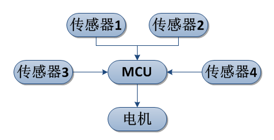

># 第一章 传感器的概述

人们为了从外界获取信息，必须借助于人类特有的感官系统。而单靠人们自身的感觉器官，在研究自然现象和规律以及生产活动中它们的功能就远远不够了。为了适应这种情况，就需要传感器。因此可以说，传感器是人类五官的重新定义。在四轴飞行器上同样也是如此。飞行器在飞行的过程中为了获取自身的姿态，同样也离不开传感器。
>## 1.1 四轴飞行器中传感器的作用

传感器是一种常用的检测装置，被广泛的应用于多个行业当中。传感器在四轴飞行器上的应用也是非常广泛的，传感器作为飞行控制系统的重要组成部分，在飞行控制系统中具有重要的作用。

要实现对飞机的飞行控制，首先要解决的是如何精确测量飞机的各种飞行参数，如飞机的姿态角、迎角、角速率、过载、飞行高度和速度等，因此出现了各种敏感元件，如陀螺仪、迎角传感器、加速度传感器、高度传感器以及位移和力传感器。在获取精确地姿态数据之后，通过飞控对数据进行实时解析，判断飞行器是否稳定飞行，如果飞行不稳定，人类可迅速做出反应，同时飞控也可通过内置算法调节动力系统，进而保证飞行器稳定的运行。

>## 1.2 四轴飞行器的工作原理

四轴飞行器由机架、飞控（MCU）、传感器和电机与电调组成。我们把飞行器比作一个人，MCU相当于人的大脑，传感器就好比人的五官。人们通过五官来感知世界，大脑作出判断，从而产生动作。而飞行器就只能通过传感器来感知周围的环境，MCU进行判断并产生动作信号。原理如图所示：

># 第二章 传感器的基础知识
>## 2.1 传感器的定义

国家标准GB7665-87对传感器下的定义是：“能感受规定的被测量并按照一定的规律转换成可用信号的器件或装置，通常由敏感元件和转换元件组成”。传感器是一种检测装置，它是实现自动检测和自动控制的首要环节。传感器能感受到被测量的信息，并能将检测感受到的信息，按一定规律变换成为电信号或其他所需形式的信息输出，以满足信息的传输、处理、存储、显示、记录和控制等要求。
>## 2.2 传感器的分类
>### 2.2.1 模拟信号型传感器

模拟信号是指用连续变化的物理量所表达的信息，如温度、湿度、压力、长度、电流、电压等等，我们通常又把模拟信号称为连续信号，它在一定的时间范围内可以有无限多个不同的取值。其输出信号为模拟信号的传感器为模拟信号型传感器。

>### 2.2.2 数字信号型传感器

数字信号指自变量是离散的、因变量也是离散的信号，这种信号的自变量用整数表示，因变量用有限数字中的一个数字来表示。在计算机中，数字信号的大小常用有限位的二进制数表示，例如，字长为2位的二进制数可表示4种大小的数字信号，它们是00、01、10和11；若信号的变化范围在-1~1，则这4个二进制数可表示4段数字范围，即[-1, -0.5)、[-0.5, 0)、[0, 0.5)和[0.5, 1]。

由于数字信号是用两种物理状态来表示0和1的，故其抵抗材料本身干扰和环境干扰的能力都比模拟信号强很多；在现代技术的信号处理中，数字信号发挥的作用越来越大，几乎复杂的信号处理都离不开数字信号；或者说，只要能把解决问题的方法用数学公式表示，就能用计算机来处理代表物理量的数字信号。其输出信号为数字信号的传感器为数字信号型传感器。

>### 2.2.3 开关信号型传感器

为通断信号，无源信号，电阻测试法为电阻0或无穷大；  也可以是有源信号，专业叫法是阶跃信号，就是0或1，可以理解成脉冲量。大多呈现两种状态，即0或1。即其输出信号为开关信号的传感器为开关信号型传感器。

>## 2.3 传感器的特性
>### 2.3.1 传感器的动态特性

所谓动态特性，是指传感器在输入变化时，它的输出的特性。在实际工作中，传感器的动态特性常用它对某些标准输入信号的响应来表示。这是因为传感器对标准输入信号的响应容易用实验方法求得，并且它对标准输入信号的响应与它对任意输入信号的响应之间存在一定的关系，往往知道了前者就能推定后者。最常用的标准输入信号有阶跃信号和正弦信号两种，所以传感器的动态特性也常用阶跃响应和频率响应来表示。

>### 2.3.2 传感器的线性度

通常情况下，传感器的实际静态特性输出是条曲线而非直线。在实际工作中，为使仪表具有均匀刻度的读数，常用一条拟合直线近似地代表实际的特性曲线、线性度(非线性误差)就是这个近似程度的一个性能指标。拟合直线的选取有多种方法。如将零输入和满量程输出点相连的理论直线作为拟合直线;或将与特性曲线上各点偏差的平方和为最小的理论直线作为拟合直线，此拟合直线称为最小二乘法拟合直线。

>### 2.3.3 传感器的迟滞性

传感器在输入量由小到大(正行程)及输入量由大到小(反行程)变化期间其输入输出特性曲线不重合的现象成为迟滞。对于同一大小的输入信号，传感器的正反行程输出信号大小不相等，这个差值称为迟滞差值。

>### 2.3.4 传感器的灵敏度

灵敏度是指传感器在稳态工作情况下输出量变化△y对输入量变化△x的比值。它是输出一输入特性曲线的斜率。如果传感器的输出和输入之间显线性关系，则灵敏度S是一个常数。否则，它将随输入量的变化而变化。灵敏度的量纲是输出、输入量的量纲之比。例如，某位移传感器，在位移变化1mm时，输出电压变化为200mV，则其灵敏度应表示为200mV/mm。当传感器的输出、输入量的量纲相同时，灵敏度可理解为放大倍数。提高灵敏度，可得到较高的测量精度。但灵敏度愈高，测量范围愈窄，稳定性也往往愈差。

>### 2.3.5 传感器的分辨力

分辨力是指传感器可能感受到的被测量的最小变化的能力。也就是说，如果输入量从某一非零值缓慢地变化。当输入变化值未超过某一数值时，传感器的输出不会发生变化，即传感器对此输入量的变化是分辨不出来的。只有当输入量的变化超过分辨力时，其输出才会发生变化。

通常传感器在满量程范围内各点的分辨力并不相同，因此常用满量程中能使输出量产生阶跃变化的输入量中的最大变化值作为衡量分辨力的指标。上述指标若用满量程的百分比表示，则称为分辨率。

>### 2.3.6 传感器的重复性

重复性是指传感器在输入量按同一方向作全量程连续多次变化时，所得特性曲线不一致的程度。各条特性曲线越靠近，说明重复性越好，随机误差就越小。

>### 2.3.2 传感器的稳定性

稳定性表示传感器在一个较长的时间内保持其性能参数的能力。理想的情况是不论什么时候，传感器的特性参数都不随时间变化。但实际上，随着时间的推移，大多数传感器的特性会发生改变。这是因为敏感器件或构成传感器的部件，其特性会随时间发生变化，从而影响传感器的稳定性。

># 第三章 传感器的应用
>## 3.1 陀螺仪 MPU-6050
>### 3.1.1 MPU-6050简介
MPU-6050数字传感器是InvenSense公司推出的全球首例6轴运动传感器。它集成了3轴MEMS陀螺仪，3轴MEMS加速计，以及一个可扩展的数字运动处器DMP(Digital Motion Processor),可用第二 个IIC接口连接外部磁力传感器，通过主IIC接口，输出一个9轴信号。
> **特点**
> * 陀螺仪和加速计分别采用16位ADC
> * 自带数字运动处理（DMP），可输出6轴或9轴（需外接磁力计）信号
> * 测量范围可控，3轴角速度传感器（陀螺仪）可测范围±250、±500、±1000、±2000°/秒（dps），3轴加速度传感器可测范围±2、±4、±8、±6g。
> * 自带数字温度传感器
> * 可输出中断，支持姿势识别、摇摄、画面放大缩小、滚动、快速下降中断、high-G中断、零动作感应、触击感应、摇动感应功能
> * 自带1024字节FIFO，有助于降低系统功耗
> * 高达400kHz的IIC通信接口
> * 宽电压，VDD范围2.5V±5%、3.0±5%或3.3±5%，MPU-6050有VLOGIC引脚，用来为IIC输出提供逻辑电平。VLOGIC电压可取1.8±5%或VDD
> * 封装尺寸小：4×4×0.9mm

QFN封装引脚图及轴向旋转方向示意图

引脚说明

>### 3.1.2 工作原理
MPU-6050作为一款物理传感器，其工作原理是利用物理效应，诸如压电效应，磁致伸缩现象，离化、极化、热电、光电、磁电等效应，将被测信号量的微小变化转换成电信号。

下面是MPU-6050的基本框图，由框图可知，传感器通过感知自身的姿态并将姿态信号转换成电压信号，通过16位高精度ADC转化成数字信号并通过自身需求配置寄存器，可使用MPU-6050自带的数字运动处理器，即DMP，将原始数据进行姿态融合解算，可通过IIC直接输出四元数数据，得到四元数之后就可以很方便的计算出欧拉角，从而得到yaw、roll和pitch。

使用内置的DMP，可以大大简化代码的设计，MCU不用进行姿态解算过程，大大降低了MCU负担，从而有更多的时间去处理其他事情，提高系统的实时性。

MPU-6050基本框图

下面我们简单介绍一下软件姿态解算原理：

 * 加速度计

 目前市面上的加速度计从输出上区分为两种：一种是数字的，另一种是模拟的。MPU-6050三轴加速度计是IIC接口的数字传感器，通过特定的配置加速度的量程，并将内部ADC的转换结果读出来，但读出来的数据是以LSB为单位的，它仍然不是g（9.8米/秒^2），需要最后的转换，我们要知道加速度计灵敏度，通常表示为LSB/g。假如我们使用2g量程时，对应灵敏度=16384LSB/G。为了得到最终力值，我们用下面公式：

**Rx=ADCRx/灵敏度**

 也就是说，当X轴的计数为ADCRx时，那么对应的加速度值就是（ADCRx/16384）g。
下面回到现实中的加速度计，从加速度计中得到的数据其实就是一个矢量加速度。下面我们看一下下面的模型，其实我们得到的就是向量R，Rx、Ry、Rz就是实际上真正的现实加速度计的X轴、Y轴、Z轴。我们假设R与X、Y、Z轴之间的角度为Axr、Ayr、Azr。
 

可以得出：

**R=SQRT（Rx^2+Ry^2+Rz^2**

**Axr=arccos(Rx/R)**

**Ayr=arccos(Ry/R)**

**Azr=arccos(Rz/R)**

已通过很多公式解释加速度计模型。我们也会很快解释陀螺仪以及如何用加速度计和陀螺仪的数据进行整合，以得到更精确的角度估计。在这之前我们先来看看更有用的公式：

**cosx=cos(Axr)=Rx/R**

**cosy=cos(Ayr)=Ry/R**

**cosz=cos(Azr)=Rz/R**
这三个公式通常被称为方向余弦。你可以轻松地验证：

**SQRT（cosx^2+cosy^2+cosz^2）=1**

这个属性可以避免见识R矢量模（长度）。我们从理论回到现实的传感器输出中，当水平放置MPU-6050，只有Z轴感受到重力向量，它将输出1g。对应的ADC值就是16384（2g的量程）。此时，R就是重力向量，Rx=0，Ry=0，Rz=R=1g。满足R^2=Rx^2+Ry^2+Rz^2 得到重力向量与各轴的夹角

Axr=arccos(Rx/R)=90度

Ayr=arccos(Ry/R)=90度

Azr=arccos(Rz/R)=90度

* 陀螺仪

>### 3.1.3 基本应用电路

典型应用电路原理图

>### 3.1.4 寄存器及其配置

>### 3.1.5 调试

>## 3.2 磁力计
>### 3.2.1 工作原理

>### 3.2.2 基本应用电路

>### 3.2.3 寄存器及其配置

>### 3.2.4 调试

>## 3.3 超声波
>### 3.3.1 工作原理

>### 3.3.2 基本应用电路

>### 3.3.3 寄存器及其配置

>### 3.3.4 调试

>## 3.4 气压计
>### 3.4.1 工作原理

>### 3.4.2 基本应用电路

>### 3.4.3 寄存器及其配置

>### 3.4.4 调试

>## 3.5 GPS定位
>### 3.5.1 工作原理

>### 3.5.2 基本应用电路

>### 3.5.3 寄存器及其配置

>### 3.5.4 调试
># 第三章 信号处理
