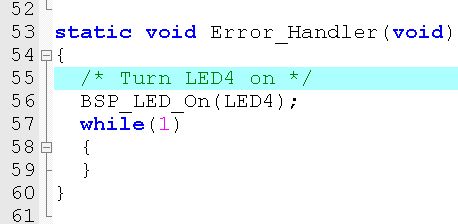

# 嵌入式操作系统

# 第01章 操作系统简介
___
>* ## 什么是操作系统
操作系统(operating system)是用户和计算机之间的界面。 一方面操作系统管理着所有计算机系统资源, 另一方面操作系统为用户提供了一个抽象概念上的计算机。在操作系统的帮助下, 用户使用计算机时, 避免了对计算机系统硬件的直接操作。  
对计算机系统而言, 操作系统是对所有系统资源进行管理的程序的集合; 对用户而言, 操作系统提供了对系统资源进行有效利用的简单抽象的方法。  
我们经常接触的就是PC操作系统了。

<div align=center>


</div>

>* ## 操作系统的分类
1. 批处理操作系统  
* 用户脱机使用计算机。用户提交作业之后直到获得结果之前就不再和计算机打交道。作业提交的方式可以是直接交给计算中心的管理操作员，也可以是通过远程通讯线路提交。提交的作业由系统外存收容成为后备作业。
* 成批处理。操作员把用户提交的作业分批进行处理。每批中的作业将由操作系统或监督程序负责作业间自动调度执行。
* 多道程序运行。按多道程序设计的调度原则，从一批后备作业中选取多道作业调入内存并组织它们运行，成为多道批处理。
2. 分时操作系统
* 交互性：首先， 用户可以在程序动态运行情况下对其加以控制。其次，用户上机提交作业方便。第三，分时系统还为用户之间进行合作提供方便。
* 多用户同时性：多个用户同时在自己的终端上上机，共享CPU和其他资源，充分发挥系统的效率。
* 独立性：客观效果上用户彼此间感觉不到有别人也在使用该台计算机，如同自己独占计算机一样。
3. 实时操作系统
* 实时时钟管理(定时处理和延时处理)。
* 连续的人-机对话，这对实时控制往往是必须的。
* 要求采取过载保护措施。例如对于短期过载，把输入任务按一定的策略在缓冲区排队，等待调度; 对于持续性过载，可能要拒绝某些任务的输入; 在实时控制系统中，则及时处理某些任务，放弃某些任务或降低对某些任务的服务频率。
* 高度可靠性和安全性需采取冗余措施。双机系统前后台工作，包括必要的保密措施等。
4. 网络操作系统
* 计算机网络是一个互连的计算机系统的群体。
* 这些计算机是自治的，每台计算机有自己的操作系统，各自独立工作，它们在网络协议控制下协同工作。
* 系统互连要通过通信设施(硬件、软件)来实现。
* 系统通过通信设施执行信息交换、资源共享、互操作和协作处理，实现多种应用要求。
5. 分布式操作系统
* 计算机网络的开发都遵循协议，而对于各种分布式系统并没有制定标准的协议。当然，计算机网络也可认为是一种分布式系统。
* 分布式系统要求一个统一的操作系统，实现系统操作的统一性。
* 分布式操作系统对用户是透明的。但对计算机网络，若一个计算机上的用户希望使用另一台计算机上的资源，则必须明确指明是哪台计算机。
* 分布式系统的基础是网络。分布式系统已不仅是一个物理上的松散耦合系统，同时还是一个逻辑上紧密耦合的系统。
* 分布式系统还处在研究阶段。而计算机网络已经在各个领域得到广泛的应用。
>* ## 嵌入式实时操作系统介绍
>>* ### "实时"操作系统的定义
嵌入式实时操作系统的英文名称是：Embedded Real-time Operation System，简写为（RTOS)。  
定义为：
当外界事件或数据产生时，能够接受并以足够快的速度予以处理，其处理的结果又能在规定的时间之内来控制生产过程或对处理系统作出快速响应，并控制所有实时任务协调一致运行的嵌入式操作系统。  
在工业控制、 军事设备、 航空航天等领域对系统的响应时间有苛刻的要求，这就需要使用实时系统。我们常常说的嵌入式操作系统都是嵌入式实时操作系统。故对嵌入式实时操作系统的理解应该建立在对嵌入式系统的理解之上加入对响应时间的要求。
>>* ### 实时操作系统和非实时操作系统的区别
实时系统指系统的计算正确性不仅取决于计算的逻辑正确性，还取决于产生结果的时间。如果不满足系统的时间约束，则认为系统失败。大家普遍的一种意识是实时性意味着速度快，实际上实时性与任务执行的速度快并不是一回事，实时性的真正含义是指“任务（最迟）完成时间（Deadline）是可以确定预知的”。
>>* ### 常见嵌入式实时操作系统
* Vxworks 

<div align=center>


</div> 

> VxWorks 操作系统是美国WindRiver公司于1983年设计开发的一种嵌入式实时操作系统（RTOS），是嵌入式开发环境的关键组成部分。良好的持续发展能力、高性能的内核以及友好的用户开发环境，在嵌入式实时操作系统领域占据一席之地。它以其良好的可靠性和卓越的实时性被广泛地应用在通信、军事、航空、航天等高精尖技术及实时性要求极高的领域中，如卫星通讯、军事演习、弹道制导、飞机导航等。在美国的 F-16、FA-18战斗机、B-2 隐形轰炸机和爱国者导弹上，甚至连1997年4月在火星表面登陆的火星探测器、2008年5月登陆的凤凰号，和2012年8月登陆的好奇号也都使用到了VxWorks上。  

<div align=center>


</div> 


> VxWorks 是美国 Wind River System 公司（ 以下简称风河公司 ，即 WRS 公司）推出的一个实时操作系统。Tornado 是WRS 公司推出的一套实时操作系统开发环境，类似MicrosoftVisual C，但是提供了更丰富的调试、仿真环境和工具。
* μC/OS  

<div align=center>


</div> 

> μC/OS 是一种基于优先级的抢占式多任务实时操作系统，包含了实时内核、任务管理、时间管理、任务间通信同步（信号量，邮箱，消息 队列）和内存管理等功能。它可以使各个任务独立工作，互不干涉，很容易实现准时而且无误执行，使实时应用程序的设计和扩展变得容易，使应用程序的设计过程大为减化。  
> μC /OS 是一个完整的、可移植、可固化、可裁剪的抢占式实时多任务内核。μC/OS 绝大部分的代码是用ANSII的C语言编写的，包含一小部分汇编代码，使之可供不同架构的微处理器使用。至今，从8位到64位，μC/OS-II已在超过40种不同架构上的微处理器上运行。μC/OS-II已经在世界范围内得到广泛应用，包括很多领域， 如手机、路由器、集线器、不间断电源、飞行器、医疗设备及工业控制上。实际上，μC/OS-II已经通过了非常严格的测试，并且得到了美国航空管 理局（Federal Aviation Administration）的认证，可以用在飞行器上。这说明μC/OS-II是稳定可靠的，可用于与人性命攸关的安全紧要（safety critical）系统。除此以外，μC/OS-II 的鲜明特点就是源码公开，便于移植和维护。
* RTLinux  

<div align=center>

</div> 

> RTLinux 是由美国新墨西哥州的fsmlabs(finite state machine labs, 有限状态机实验室)公司开发的、利用linux开发的面向实时和嵌入式应用的操作系统。  
到目前为止，RT-Linux已经成功地应用于航天飞机的空间数据采集、科学仪器测控和电影特技图像处理等广泛领域，在电信、工业自动化和航空航天等实时领域也有成熟应用。随着信息技术的飞速发展，实时系统已经渗透到日常生活的各个层面，包括传统的数控领域、军事、制造业和通信业，甚至连潜力巨大的信息家电、媒体广播系统和数字影像设备都对实时性提出了愈来愈高的要求。


# 第02章 LiteOS
---
>* ## LiteOS简介
> Huawei LiteOS 是华为面向IoT领域，构建的“统一物联网操作系统和中间件软件平台”，以轻量级（内核小于10k）、低功耗（1节5号电池最多可以工作5年），快速启动，互联互通，安全等关键能力，为开发者提供 “一站式” 完整软件平台，有效降低开发门槛、缩短开发周期。

<div align=center>


</div> 

>* ## LiteOS开发入门
LiteOS 官网 <http://www.huawei.com/minisite/liteos/cn/>   
从官网可以简单了解到华为LiteOS的设计意图、使用场景和相关资源等信息。  

LiteOS 内核源码 <https://github.com/LITEOS/LiteOS_Kernel>

访问上述地址可以下载到最新的或者已经发布的内核源码。比如我下载到的目前（2017-9-20）已经发布的最新版是 LiteOS_Kernel-1.1.1。下载的源码相关文件主要包含：
* doc: Kernel标准API测试文档以及IAR/Keil的第三方移植指导文档
* example：Kernel标准API测试套
* kernel：Huawei_LiteOS操作系统的基础内核源码
* platform：Kernel支持的平台相关代码
* projects：IAR或Keil等IDE的kernel移植示例工程
* user：用户文件（存放了一个 main.c）
* LICENSE：版权声明
* MAINTAINER：主要作者
* README.md：

<div align=center>


</div> 

有了源码我们还需要一个硬件平台进行测试，后续内容将会基于 STM32F429I-Discovery进行介绍。
STM32F429I-Discovery 官网信息：<>


>>* ### 内核源码下载
内核源码下载地址 <https://github.com/LITEOS/LiteOS_Kernel>
>>* ### 开发资料下载
华为官网相关开发资料
<http://developer.huawei.com/ict/cn/site-iot/article/liteos-start>  
这个网站有很多开发链接，针对不同平台开发环境搭建、编译、调试的都有，页面还有些视频。  
>* ## LiteOS在STM32F429I-Discovery 移植测试
下载到的源码中，已经包含了一些移植相关的文档，这些文档是使用 Markdown 语言编写的。  
在 LiteOS_Kernel-1.1.1\doc 路径下，LiteOS_Migration_Guide_stm32f429_Keil.md 文档介绍了，如何使用下载的源码在 STM32F429I-Discovery 上进行测试。主要有以下步骤：
* 从            <http://www.st.com/content/st_com/en/products/evaluation-tools/product-evaluation-tools/mcu-eval-tools/stm32-mcu-eval-tools/stm32-mcu-discovery-kits/32f429idiscovery.html> 下载 STM32F4系列官方固件库

<div align=center>


</div> 

* 在 LiteOS_Kernel-1.1.1 路径下新建一个文件夹，名称 STM32FXX
* 在  LiteOS_Kernel-1.1.1 路径下新建一个文件夹，名称 stm32f429
* 把 STM32Cube_FW_F4_V1.14.0 下的 Drivers 文件夹 拷贝到：LiteOS_Kernel-1.1.1\STM32FXX
* 把 STM32Cube_FW_F4_V1.14.0\Projects\STM32F429I-Discovery\Examples\UART\UART_TwoBoards_ComPolling 下的 Inc 和 Src 2 个文件夹拷贝到：LiteOS_Kernel-1.1.1\STM32FXX\stm32f429

* 把 STM32Cube_FW_F4_V1.14.0\Projects\STM32F429I-Discovery\Examples\UART\UART_TwoBoards_ComPolling\MDK-ARM 下面 的 startup_stm32f429xx.s 拷贝到 ：LiteOS_Kernel-1.1.1\STM32FXX\stm32f429  
* 按照上述操作后，新建的 STM32FXX 文件夹中包含如下内容。

<div align=center>


</div> 

* 使用 Keil 打开 LiteOS STM32F429I-Discovery 工程文件  HuaweiLiteOS.uvprojx

<div align=center>


</div> 

* 移除原来的 startup_stm32f429xx.s 启动文件，替换为：LiteOS_Kernel-1.1.1\STM32FXX\stm32f429 下的 startup_stm32f429xx.s 文件，
因为LiteOS的默认startup汇编文件中只实现了能够使LiteOS运行的最小功能。  

* 通过工程文件整理按钮，来添加一个 Group，名为 stm32fxxx

<div align=center>


</div> 

* 向上一步新建的 Group 中添加 LiteOS_Kernel-1.1.1\STM32FXX\stm32f429\Src  路径下的 以下 3 个文件：
```
stm32f4xx_hal_msp.c
stm32f4xx_it.c
system_stm32f4xx.c
```

* 继续向 Group 中添加 LiteOS_Kernel-1.1.1\STM32FXX\Drivers\STM32F4xx_HAL_Driver\Src 路径下的以下 15 个文件。

```
stm32f4xx_hal.c
stm32f4xx_hal_cortex.c
stm32f4xx_hal_dma.c
stm32f4xx_hal_flash.c
stm32f4xx_hal_gpio.c
stm32f4xx_hal_i2c.c
stm32f4xx_hal_pwr.c
stm32f4xx_hal_pwr_ex.c
stm32f4xx_hal_rcc.c
stm32f4xx_hal_rcc_ex.c
stm32f4xx_hal_rtc.c
stm32f4xx_hal_rtc_ex.c
stm32f4xx_hal_spi.c
stm32f4xx_hal_uart.c
stm32f4xx_hal_flash_ex.c
```

* 继续向 Group 中添加 LiteOS_Kernel-1.1.1\STM32FXX\Drivers\BSP\STM32F429I-Discovery 路径下的以下 1 个文件。

>* stm32f429i_discovery.c  

* 修改 platform/stm32f429i Group 中 los_bsp_adapter.c 文件中的  sys_clk_freq （第 34 行）
修改为：const unsigned int sys_clk_freq = 180000000;

* main.c 文件中添加系统时钟初始化代码

<div align=center>


</div> 

默认是没有 SystemClock_Config 函数的，从 STM32Cube_FW_F4_V1.14.0\Projects\STM32F429I-Discovery\Examples\UART\UART_TwoBoards_ComPolling\Src 中的 main.c 文件复制过来的内容如下：

```
/**
  * @brief  System Clock Configuration
  *         The system Clock is configured as follow : 
  *            System Clock source            = PLL (HSE)
  *            SYSCLK(Hz)                     = 180000000
  *            HCLK(Hz)                       = 180000000
  *            AHB Prescaler                  = 1
  *            APB1 Prescaler                 = 4
  *            APB2 Prescaler                 = 2
  *            HSE Frequency(Hz)              = 8000000
  *            PLL_M                          = 8
  *            PLL_N                          = 360
  *            PLL_P                          = 2
  *            PLL_Q                          = 7
  *            VDD(V)                         = 3.3
  *            Main regulator output voltage  = Scale1 mode
  *            Flash Latency(WS)              = 5
  * @param  None
  * @retval None
  */
static void SystemClock_Config(void)
{
  RCC_ClkInitTypeDef RCC_ClkInitStruct;
  RCC_OscInitTypeDef RCC_OscInitStruct;

  /* Enable Power Control clock */
  __HAL_RCC_PWR_CLK_ENABLE();
  
  /* The voltage scaling allows optimizing the power consumption when the device is 
     clocked below the maximum system frequency, to update the voltage scaling value 
     regarding system frequency refer to product datasheet.  */
  __HAL_PWR_VOLTAGESCALING_CONFIG(PWR_REGULATOR_VOLTAGE_SCALE1);
  
  /* Enable HSE Oscillator and activate PLL with HSE as source */
  RCC_OscInitStruct.OscillatorType = RCC_OSCILLATORTYPE_HSE;
  RCC_OscInitStruct.HSEState = RCC_HSE_ON;
  RCC_OscInitStruct.PLL.PLLState = RCC_PLL_ON;
  RCC_OscInitStruct.PLL.PLLSource = RCC_PLLSOURCE_HSE;
  RCC_OscInitStruct.PLL.PLLM = 8;
  RCC_OscInitStruct.PLL.PLLN = 360;
  RCC_OscInitStruct.PLL.PLLP = RCC_PLLP_DIV2;
  RCC_OscInitStruct.PLL.PLLQ = 7;
  if(HAL_RCC_OscConfig(&RCC_OscInitStruct) != HAL_OK)
  {
    Error_Handler();
  }

  /* Activate the Over-Drive mode */
  HAL_PWREx_EnableOverDrive();
 
  /* Select PLL as system clock source and configure the HCLK, PCLK1 and PCLK2 
     clocks dividers */
  RCC_ClkInitStruct.ClockType = (RCC_CLOCKTYPE_SYSCLK | RCC_CLOCKTYPE_HCLK | RCC_CLOCKTYPE_PCLK1 | RCC_CLOCKTYPE_PCLK2);
  RCC_ClkInitStruct.SYSCLKSource = RCC_SYSCLKSOURCE_PLLCLK;
  RCC_ClkInitStruct.AHBCLKDivider = RCC_SYSCLK_DIV1;
  RCC_ClkInitStruct.APB1CLKDivider = RCC_HCLK_DIV4;  
  RCC_ClkInitStruct.APB2CLKDivider = RCC_HCLK_DIV2;  
  if(HAL_RCC_ClockConfig(&RCC_ClkInitStruct, FLASH_LATENCY_5) != HAL_OK)
  {
    Error_Handler();
  }
}
```
<div align=center>


</div>

添加个 错误处理函数：

```
static void Error_Handler(void)
{
  /* Turn LED4 on */
  BSP_LED_On(LED4);
  while(1)
  {
  }
}
```
<div align=center>



</div>

注释 stm32f4xx_it.c 文件 中 无用的中断
```
#if 0
/**
  * @brief  This function handles PendSVC exception.
  * @param  None
  * @retval None
  */
void PendSV_Handler(void)
{
}

/**
  * @brief  This function handles SysTick Handler.
  * @param  None
  * @retval None
  */
void SysTick_Handler(void)
{
  HAL_IncTick();
}
#endif
``` 
<div align=center>


</div>


* 将stm32f4xx_hal_msp.c中的main.h替换成los_bsp_uart.h。
```
/* Includes ------------------------------------------------------------------*/
//#include "main.h"
#include "los_bsp_uart.h"
```
添加文件路径  

<div align=center>


</div>

添加宏条件

```
USE_HAL_DRIVER,STM32F429xx,USE_STM32F429I_DISCO,LOS_STM32F429ZI
```
<div align=center>


</div>

># 下载、查看现象
* STM32F429I-Discovery 自带的 STLink将上述工程编译文件下载到板子中
* 通过USB转串口查看串口打印的信息，默认（Tx:PB6 Rx:PB7）
* 看到每秒钟输出一次 Board Text。
<div align=center>


</div>

# 第03章 基于LiteOS的开发
---
>* ## LiteOS提供的 API 介绍
>* ## LiteOS API 学习
……
